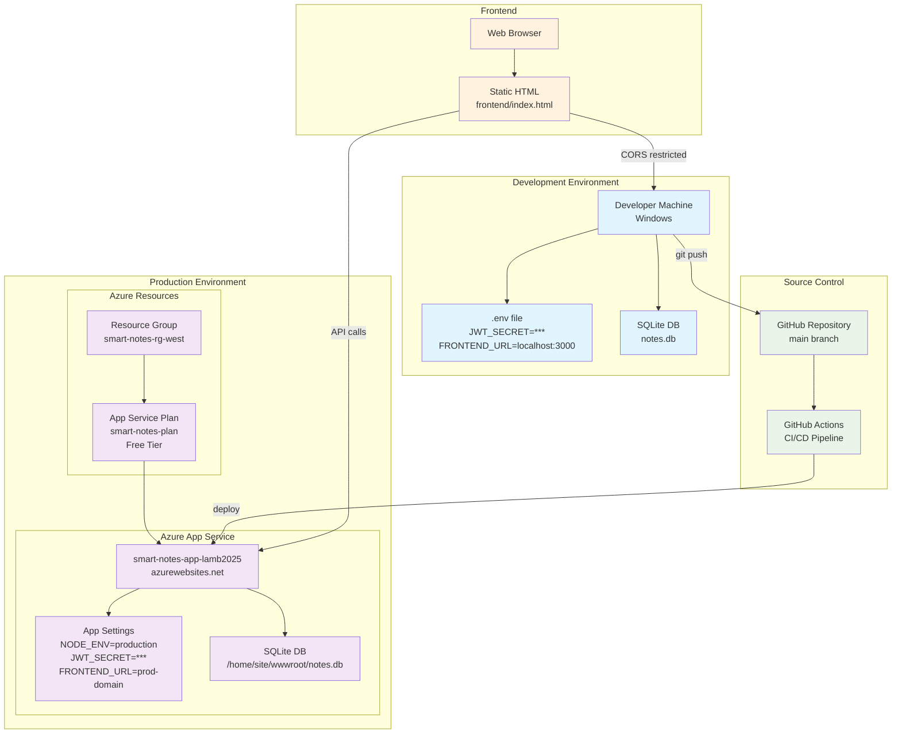

# Smart-Note-Taking-Web-App-Implementation-Guide

This repository contains a simple Node.js backend used to experiment with a smart note taking API.
It exposes REST endpoints for creating, reading, updating and deleting documents that are stored in
memory. The server is intended as a starting point for further development.

## 🏗️ Deployment Architecture



### 🔧 Environment Configuration

| Component | Development | Production |
|-----------|-------------|------------|
| **Platform** | Windows Local | Azure App Service |
| **Node.js** | 18+ | 20 LTS |
| **Database** | SQLite (local) | SQLite (Azure) |
| **JWT Secret** | 256-bit secure | 256-bit secure |
| **CORS Origin** | localhost:3000 | azurewebsites.net |
| **Storage** | Local filesystem | Azure App Service filesystem |
| **Environment** | .env file | Azure App Settings |

### 🌐 Network Flow

```
Client Browser → Frontend (index.html) → API Calls → Backend Server
                                              ↓
                                         JWT Authentication
                                              ↓
                                         SQLite Database
```

### 🔧 Local Development Setup

**Prerequisites:**
- Node.js 18 or newer
- Git (for version control)

**Getting Started:**

1. **Clone and Install:**
   ```bash
   git clone https://github.com/your-username/Smart-Note-Taking-Web-App-Implementation-Guide.git
   cd Smart-Note-Taking-Web-App-Implementation-Guide/backend
   npm install
   ```

2. **Environment Configuration:**
   ```bash
   # Copy example environment file
   cp .env.example .env
   
   # Edit .env with your values:
   NODE_ENV=development
   JWT_SECRET=your-super-secret-jwt-key-change-this-in-production
   DB_FILE=notes.db
   FRONTEND_URL=http://localhost:3000
   ```

3. **Start Development Server:**
   ```bash
   npm start
   # or for development with auto-reload:
   npm run dev
   ```

4. **Run Tests:**
   ```bash
   npm test
   # or run all tests including enhanced suite:
   npm run test:all
   ```

5. **Access the Application:**
   - API: `http://localhost:5000`
   - Frontend: Open `frontend/index.html` in your browser
   - Test credentials: `admin` / `admin123`

## Prerequisites

- Node.js 18 or newer

## Getting Started

1. Install dependencies:

   ```bash
   cd backend
   npm install
   ```

2. Start the development server:

   ```bash
   npm start
   ```

   The API will be available at `http://localhost:5000` by default.
   Set the `DATA_FILE` environment variable to persist documents to a JSON file.
   Alternatively, provide a `DB_FILE` path to use a SQLite database.
   You must set `JWT_SECRET` to a strong random value for consistent sessions.
   Optionally set `FRONTEND_URL` to restrict CORS access (defaults to
   `http://localhost:3000`).

3. Run the test suite:

  ```bash
  npm test
  ```

### Database Configuration

To store notes in SQLite instead of memory, set the `DB_FILE` environment
variable to the path of a `.db` file before starting the server. The database
and required table will be created automatically if they do not exist.

## API Endpoints

- `GET /api/documents` – list all documents
- `POST /api/documents` – create a new document (expects JSON `{ title, content }`)
- `GET /api/documents/:id` – get a document by id
- `PUT /api/documents/:id` – update a document
- `DELETE /api/documents/:id` – remove a document

By default, documents are stored in memory so they reset when the server restarts.
Set a `DATA_FILE` path to persist them across sessions, or consider using a database for a real application.

## Security Notes

### 🔐 Security Features Implemented

- **JWT Authentication**: 256-bit cryptographically secure tokens
- **CORS Protection**: Origin restricted to specific domains
- **Rate Limiting**: 100 requests per 15 minutes per IP address
- **Payload Limits**: 1MB maximum request size
- **Environment Variables**: All secrets externalized and secured

### 🔒 Security Configuration

| Security Layer | Implementation |
|----------------|----------------|
| **Authentication** | JWT tokens with secure secret |
| **Authorization** | Token-based API access |
| **CORS** | Restricted to configured frontend URL |
| **Rate Limiting** | IP-based request throttling |
| **Input Validation** | JSON parsing with size limits |
| **Secret Management** | Environment variables only |

### ⚙️ Environment Variables

**Required Variables:**
```bash
NODE_ENV=production              # Environment mode
JWT_SECRET=<256-bit-secret>      # Cryptographically secure
FRONTEND_URL=<your-domain>       # CORS restriction
DB_FILE=<database-path>          # SQLite database location
```

**Optional Variables:**
```bash
PORT=5000                        # Server port (defaults to 5000)
LOG_LEVEL=info                   # Logging level
JWT_EXPIRES_IN=24h               # Token expiration
```

## Next Steps

The following improvements are recommended but not yet implemented:

<!-- Database integration implemented -->
- Database integration via SQLite is now available. Set `DB_FILE` to a path
  to use a SQLite database instead of the in-memory array.
- A web frontend for interacting with the API is available in `frontend/index.html`.
- Expand tests to cover edge cases and database logic once added.
- Additional authentication test verifies refresh tokens are invalidated after logout.
 - Continuous integration is configured with GitHub Actions to run tests automatically, including authentication tests.
- Configure continuous deployment to Azure with GitHub Actions.
- Set up a custom domain and HTTPS for the web app.
- Add authentication and user management.

### Deploying to Azure

**Automated Deployment (Recommended):**

The repository is configured with GitHub Actions for continuous deployment:

1. **Fork the repository** and configure Azure credentials
2. **Push changes** to the main branch
3. **GitHub Actions** will automatically deploy to Azure

**Manual Deployment:**

If you prefer manual deployment to Azure App Service:

1. **Install Azure CLI and sign in:**
   ```bash
   az login
   ```

2. **Create Azure resources:**
   ```bash
   az group create --name smart-notes-rg-west --location westus
   az appservice plan create --name smart-notes-plan --resource-group smart-notes-rg-west --sku B1 --is-linux
   az webapp create --resource-group smart-notes-rg-west --plan smart-notes-plan --name your-app-name --runtime "NODE|20-lts"
   ```

3. **Configure environment variables:**
   ```bash
   az webapp config appsettings set \
     --resource-group smart-notes-rg-west \
     --name your-app-name \
     --settings \
       NODE_ENV=production \
       JWT_SECRET="$(openssl rand -base64 32)" \
       FRONTEND_URL=https://your-app-name.azurewebsites.net \
       DB_FILE=/home/site/wwwroot/notes.db
   ```

4. **Deploy the application:**
   ```bash
   az webapp deploy --resource-group smart-notes-rg-west --name your-app-name --src-path backend
   ```

**Important Security Notes:**
- Always use a strong, unique JWT_SECRET in production
- Configure FRONTEND_URL to match your actual domain
- Never commit .env files to the repository
- Use Azure App Service environment variables for sensitive data

### 🚀 Current Deployment Status

**Production Environment (Azure App Service):**

| Configuration | Value |
|---------------|-------|
| **URL** | https://smart-notes-app-lamb2025.azurewebsites.net |
| **Resource Group** | smart-notes-rg-west (West US) |
| **App Service Plan** | smart-notes-plan (Free tier) |
| **Runtime** | Node.js 20 LTS |
| **Database** | SQLite (/home/site/wwwroot/notes.db) |
| **Environment** | Production |
| **Security** | JWT + CORS + Rate Limiting |

**Environment Variables Configured:**
```bash
NODE_ENV=production
JWT_SECRET=lwnBztYuQywf9xtdRfomdWHeuRQXF5Y1ZOk3BWe8mDE=
FRONTEND_URL=https://smart-notes-app-lamb2025.azurewebsites.net
DB_FILE=/home/site/wwwroot/notes.db
LOG_LEVEL=info
JWT_EXPIRES_IN=24h
```

**✅ Production Ready Features:**
- Secure JWT authentication with 256-bit secret
- CORS restricted to production domain
- Rate limiting and payload protection
- Persistent SQLite database
- Environment-based configuration
- All secrets externalized and secured

### 🔧 Local Development Setup


